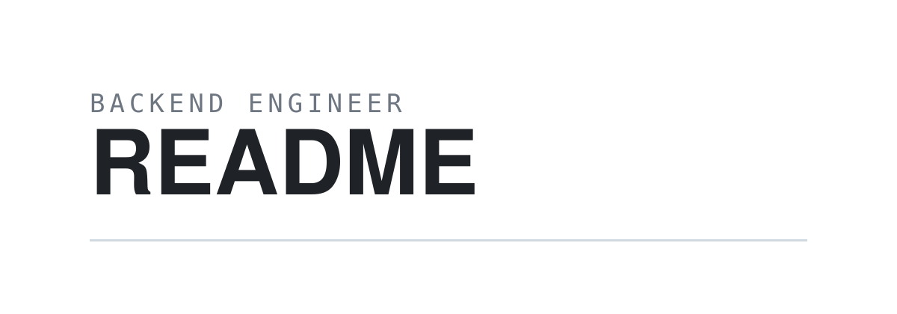

  

 

  보이지 않는 곳에서 단단하게 동작하는 서버를 만듭니다. 
  화려함보다 신뢰를, 빠른 구현보다 오래 버티는 구조를 생각합니다.

  

 

<table>
  <tr>
    <td width="140"><samp>FOCUS</samp></td>
    <td>
      대용량 트래픽을 견디는 <b>서버 설계</b> 
      경계가 분명한 <b>도메인 모델</b>과 열린 아키텍처 
      읽는 사람을 배려한 <b>코드와 커밋</b>
    </td>
  </tr>
  <tr>
    <td><samp>STACK</samp></td>
    <td>
      <samp>Language</samp>&nbsp;&nbsp; Java · Kotlin · Dart 
      <samp>Backend</samp>&nbsp;&nbsp;&nbsp; Spring Boot · JPA · MSA 
      <samp>Infra</samp>&nbsp;&nbsp;&nbsp;&nbsp;&nbsp; MySQL · Redis · Docker · AWS 
      <samp>Tools</samp>&nbsp;&nbsp;&nbsp;&nbsp;&nbsp; Git · GitHub Actions · IntelliJ
    </td>
  </tr>
  <tr>
    <td><samp>NOW</samp></td>
    <td>
      결제 도메인을 이벤트 기반으로 재설계하는 중입니다.
    </td>
  </tr>
</table>

 

<table>
  <tr>
    <td align="center" width="25%">
      <h3>2,431</h3>
      <samp>commits</samp>
    </td>
    <td align="center" width="25%">
      <h3>312</h3>
      <samp>pull requests</samp>
    </td>
    <td align="center" width="25%">
      <h3>27</h3>
      <samp>repositories</samp>
    </td>
    <td align="center" width="25%">
      <h3>847</h3>
      <samp>day streak</samp>
    </td>
  </tr>
</table>

 

  <samp>REACH</samp> 
  <a href="mailto:dntjd4562@gmail.com">dntjd4562@gmail.com</a>

